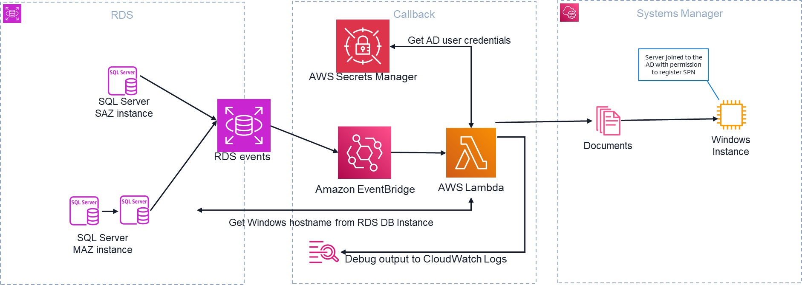

## Getting Started

This repository contains a sample SAM template for automating SPN updates upon host replacement for Kerberos with Amazon RDS for SQL Server.

## Disclaimer

By implementing this solution, you acknowledge that you are responsible for owning, maintaining, and troubleshooting the solution. AWS Support may provide assistance, but ultimate responsibility for the solution’s functionality and any future errors lies with you, the customer.

The automation process for writing Service Principal Names (SPNs) may add a few seconds to the normal RDS DB Instance failover time. This slight increase in failover duration is due to the additional steps required to update the SPNs.

The successful operation of this solution relies on proper permissions and network connectivity. If future SPN updates fail due to removed permissions or firewall rules preventing proper communication, Windows logon to the RDS DB Instance may fail. It is crucial to maintain the necessary permissions and verify network connectivity for the solution to function correctly.

By proceeding with the implementation, you acknowledge these considerations and agree to manage the solution accordingly.

## Prerequisites

We use the Active Directory user [created](https://docs.aws.amazon.com/AmazonRDS/latest/UserGuide/USER_SQLServer_SelfManagedActiveDirectory.SettingUp.html#USER_SQLServer_SelfManagedActiveDirectory.SettingUp.CreateADuser) during the process of joining the RDS for SQL Server DB instance to the self-managed Active Directory to establish the connection to the SQL Server instance.

Verify the [AWS SAM CLI](https://docs.aws.amazon.com/serverless-application-model/latest/developerguide/serverless-sam-cli-install.html) is installed.

The RDS for SQL Server DB Instance runs in a private subnet.

The user needs to be manually added to the SQL Server instance LOGINS with the **PUBLIC** server role:

```sql
USE [master]

GO

CREATE LOGIN [EXAMPLE\svcRDS] FROM WINDOWS WITH DEFAULT_DATABASE=[master], DEFAULT_LANGUAGE=[us_english]

GO
```

## Deployment

**Initialize the SAM Project (if needed)**

```bash
sam init
```
Follow the prompts to generate a new project.

**Build the SAM Application**

```bash
sam build
```
This processes the `template.yaml` file, preparing dependencies and creating artifacts.

**Package the Application**

Upload artifacts to an S3 bucket by running:

```bash
sam package --s3-bucket <YOUR_S3_BUCKET> --output-template-file packaged.yaml
```
Replace `<YOUR_S3_BUCKET>` with the name of an existing S3 bucket in your AWS account.

**Deploy the Application**
```bash
sam deploy --template-file packaged.yaml --stack-name <STACK_NAME> --capabilities CAPABILITY_IAM
```
Replace `<STACK_NAME>` with your desired CloudFormation stack name.

**Notes**

- Use `sam deploy --guided` for an interactive deployment process that saves configuration settings for future use.

- The template deploys an AWS Lambda function within the specified subnet and virtual private cloud (VPC). This function connects to an RDS DB instance to retrieve the new hostname.

- Consider re-using the secret created for the Self-Managed Active Directory integration.

- The function is triggered automatically whenever a replacement or failover event occurs, managed by Amazon EventBridge. After the new hostname is obtained, the Lambda function executes an AWS Systems Manager document on the Windows instance to deregister the old hostname and update it with the new one.

Throughout this process, each step is logged in AWS CloudWatch to facilitate integration and diagnostics, providing visibility into the workflow, as shown in the following figure.



## Clean up

To remove the resources deployed using the SAM template, you can use the `sam delete` command. This will delete the resources provisioned for the solution through CloudFormation from your AWS account.

## Security

See [CONTRIBUTING](CONTRIBUTING.md#security-issue-notifications) for more information.

## License

This library is licensed under the MIT-0 License. See the [LICENSE](LICENSE) file.
